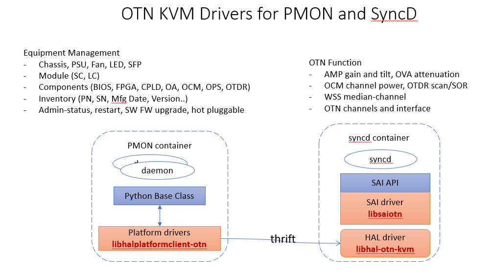

# OTN kvm Driver Libs
This repository provides the source code and pre-built debian packages used in otn kvm platform and devices.
- SAI driver to simulate OTN optical functional blocks
- SONiC platform (PMON) driver for generic HW is implemented as a thrift clinet.
- thrift server running in SyncD container to response to the clinet request.
  
The following diagram shows how are the libs are used in a OTN kvm device:

